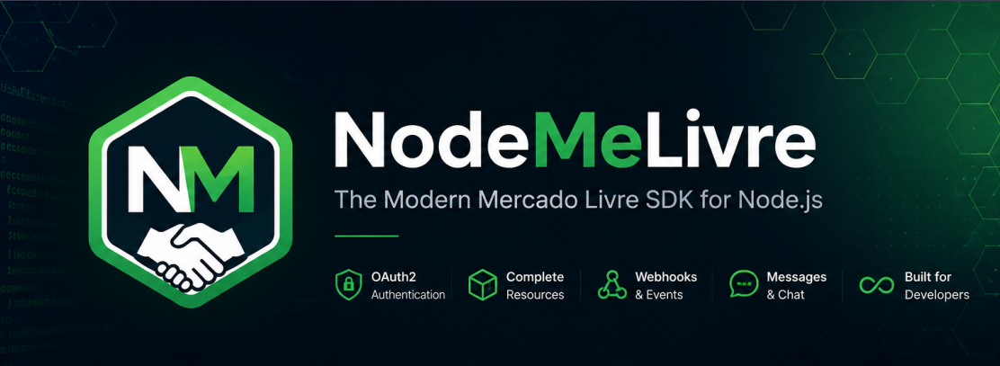
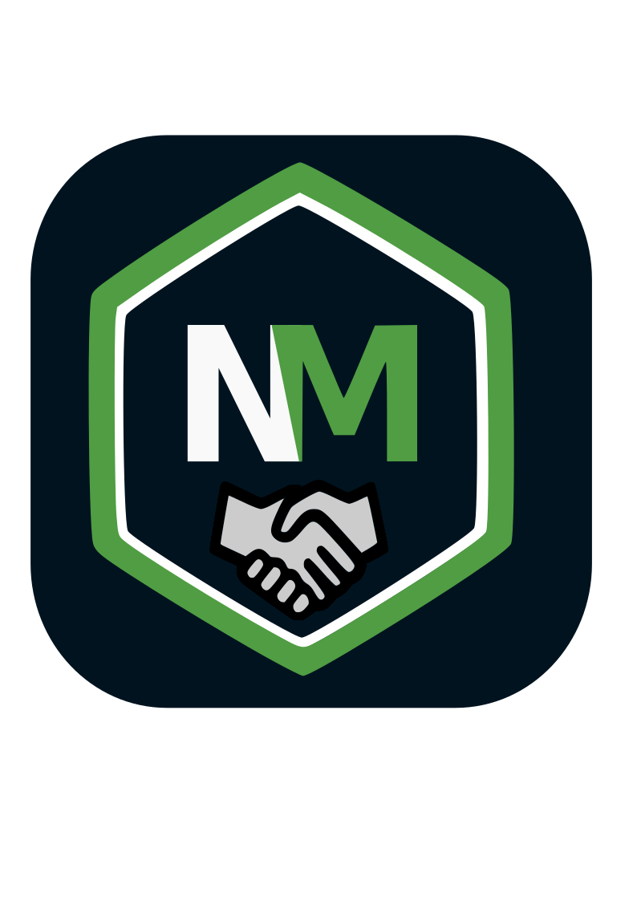

# NodeMeLivre

<p align="center">
  
</p>

<p align="center">
  
</p>

**SDK TypeScript oficial para a API do Mercado Livre** — simples, tipado e pronto para produção.

Autentica, cria anúncios com foto e variações, pagina buscas, recebe notificações em tempo real e conversa com compradores. Tudo em uma API limpa, sem gambiarras.

---

## Instalação

```bash
npm install @nodemelivre/sdk
```

> Requer **Node 18.17+** (usa `fetch` nativo).

---

## O que você precisa

1. **Uma aplicação no Mercado Livre** — crie em [developers.mercadolivre.com](https://developers.mercadolivre.com.br) e anote:
   - `Client ID` (App ID)
   - `Client Secret`
   - `Redirect URI` (ex.: `https://seusite.com/callback`)

2. **Credenciais no `.env`**:
   ```env
   ML_CLIENT_ID=seu_client_id
   ML_CLIENT_SECRET=seu_client_secret
   ML_SITE_ID=MLB          # ou MLA, MLC, etc.
   ```

---

## Fluxo em 3 passos

### 1. Configure e autorize
```ts
import { createMercadoLivre } from '@nodemelivre/sdk'

const ml = createMercadoLivre({
  clientId: process.env.ML_CLIENT_ID!,
  clientSecret: process.env.ML_CLIENT_SECRET!,
  siteId: 'MLB'
})

// URL para o vendedor clicar e autorizar seu app
const url = ml.authorizationUrl('https://seusite.com/callback')
// → redirecione o usuário para essa URL
```

### 2. Troque o código por token (uma vez)
```ts
// No seu endpoint de callback (ex.: /callback?code=XYZ)
const token = await ml.authenticate('https://seusite.com/callback', codeRecebido)
// Token salvo automaticamente (em memória ou arquivo). Próximas chamadas usam ele sozinho.
```

### 3. Use a API
```ts
// Meus dados
const eu = await ml.users.me()

// Cria anúncio com foto + variações (tamanho/cor)
const foto = await ml.images.upload(bufferDaFoto, { filename: 'camiseta.jpg' })
const item = await ml.items.createAndPublish({
  site_id: 'MLB',
  title: 'Camiseta dry-fit P/M/G',
  category_id: 'MLB1234',
  price: 49.9,
  currency_id: 'BRL',
  available_quantity: 30,
  pictures: [{ source: foto.variations[0].secure_url }],
  variations: [{
    attribute_combinations: [{ name: 'Tamanho', value_name: 'M' }],
    price: 49.9,
    available_quantity: 10,
    picture_ids: [foto.id]
  }]
})

// Busca paginada — sem loop manual de offset
for await (const produto of ml.items.list('MLB', { q: 'fone bluetooth' })) {
  console.log(produto.title)
}

// Webhooks: notificação em tempo real (nova venda, pergunta, mensagem)
app.post('/webhook', (req, res) => {
  const notif = ml.webhooks.verify(req.body, process.env.ML_CLIENT_ID!)
  if (notif.topic === 'orders_v2') {
    // nova venda chegou
  }
  res.sendStatus(200) // deve responder em < 500ms
})

// Chat com comprador
const msgs = await ml.messages.list(packId, sellerId)
await ml.messages.send({
  from: { user_id: sellerId },
  to: { user_id: buyerId, resource: packId, site_id: 'MLB' },
  text: 'Seu pedido já foi enviado!'
})

// Etiqueta de envio (PDF)
const pdf = await ml.shipments.printLabel(shipmentId, { format: 'pdf' })
await writeFile('etiqueta.pdf', Buffer.from(pdf))
```

---

## O que vem na caixa

| Recurso | O que faz |
|---------|-----------|
| **Auth** | OAuth2 completo — `authorization_code`, `refresh_token`, `credentials`. Refresh automático, dedupe, token store pluggável (memória ou arquivo). |
| **Items** | CRUD, busca, **paginação automática** (`for await`), **createAndPublish** (cria + garante ativo), `publish`/`pause`. |
| **Orders** | Busca, detalhes, **waitUntilPaid** (polling com timeout). |
| **Shipments** | Rastreio, **printLabel** (PDF/ZPL → `ArrayBuffer`). |
| **Questions** | Busca, `answer`, `reply` (responde + marca respondida). |
| **Images** | `upload(Blob | Buffer | Uint8Array)` → multipart, retorna `id` + variações de tamanho no CDN. |
| **Messages** | Chat pós-venda: `list`, `get`, `send` (comprador ↔ vendedor). |
| **Webhooks** | `parse` + `verify(applicationId)` — validação real do ML (não usa HMAC). |
| **Erros tipados** | `ApiError` (por status), `RateLimitError`, `NetworkError`, `OAuthError`, `PollingTimeoutError`, `WebhookError`. |
| **HTTP robusto** | Retry com backoff, timeout, rate-limit automático (`X-Rate-Limit-*`), eventos para observabilidade. |

---

## Exemplos prontos

```bash
# Autenticação + token em arquivo
npx tsx examples/file-token-store.ts

# Upload de imagem + anúncio com variações
npx tsx examples/upload-e-variacoes.ts

# Paginação + operações nível 3
npx tsx examples/nivel-3-paginacao.ts
npx tsx examples/nivel-3-completo.ts

# Webhooks + messages
npx tsx examples/webhooks-e-messages.ts

# Eventos (request/retry/rateLimit/tokenRefreshed)
npx tsx examples/events.ts
```

---

## Pacotes individuais (leveza)

```bash
npm install @nodemelivre/items @nodemelivre/orders @nodemelivre/webhooks
# instale só o que usa — cada pacote é independente
```

---

## Requisitos

- **Node 18.17+** (fetch, Blob, FormData nativos)
- **Conta Mercado Livre** com aplicação criada

---

## Links

- 📖 [Documentação completa](https://github.com/Rafa-MKR2/NodeMeLivre/tree/main/docs) — ADRs, roadmap, releases
- 🐛 [Issues](https://github.com/Rafa-MKR2/NodeMeLivre/issues)
- 📦 [npm](https://www.npmjs.com/package/@nodemelivre/sdk)

---

## Licença

MIT — uso livre, inclusive comercial.